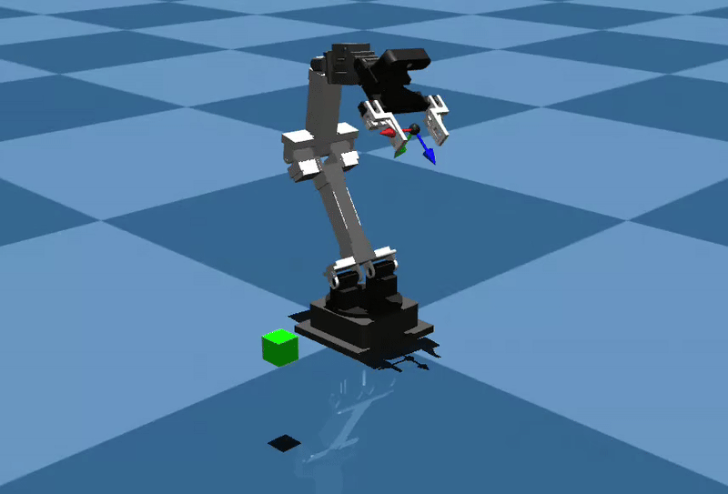
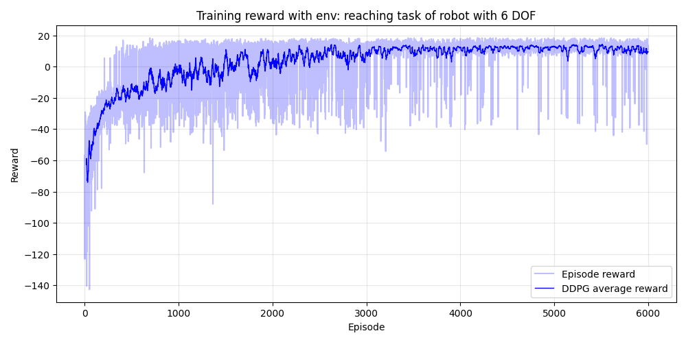
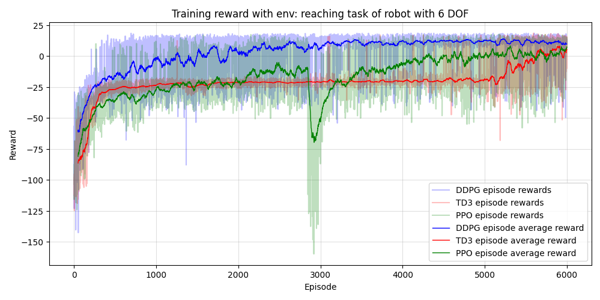

# Robot Reaching Task with Reinforcement Learning

Since I cannot find so many people applying the Reinforcement Learning algorithm on customized robot, I wrote this github doc to do so. 

This git hub repo uses serveral Reinforcement Learning algorithms on robot reaching task. The current updated algorithms are DDPG, TD3 and PPO. 

And we are using a customized robot, so I believe that whatever posted here should also be possible to migrate to your own robot setup.

I am working on Ubuntu 24.04 with VS code IDE for this repo.

## Robot Environment Features

- **MuJoCo-based 6-DOF robot** with a gripper (8 actuators total)
- **Dense reward function** for reaching tasks. If the robot reaches the goal position, a success bonus will be added by `r += 10`.
- **Observation space** includes:
  - End-effector relative position to goal.
  - End-effector velocity.
  - Gripper state, we fix this at the open state for training since we are only concerned with reaching task.
  - On-goal indicator: whether the robot end-effector reference point reaches the goal.
- **Continuous action space**: `[dx, dy, dz]` incremental movements upon the end-effector of the robot.
- **IK solver** using Damped Least Squares (DLS) to compute joint position updates.
- **Visualization** via MuJoCo viewer.
- **Robot workspace and taskspace** the robot workspace is a sampling set on its entire workspace defined in its URDF. The taskspace of the robot is a subset of the workspace. And in this robot environment, we sampled a tank of points from the robot workspace to train the robot end-effector to reach there.
- The robot environment of this reaching task is shown in the GIF. The green cube is the target or goal to reach for the robot.


---

## Before coding, please DO the following first

1. Make sure your create a venv inside your working directory. And activate this first before install any packages in the following.
```
python -m venv venv

source venv/bin/activate
```

2. Install numpy and matplotlib for numbers management and plotting
```
pip install numpy

pip install matplotlib
```

3. As for Pytorch, I recommend you go to its official website: https://pytorch.org/ and find the **Install PyTorch** to find which installation command suits your computer. And to check your CUDA version, run the following command in the terminal:

```
nvidia-smi
```

4. Install Pybullet for robot workspace sampling (Note: this will sample the entire workspace).

```
pip install pybullet
```

5. Install the stable baseline 3 to grab some usefull function like: NormalActionNoise for DDPG agent.

```
pip install stable-baselines3[extra]
```

6. Install Mujoco for robot physics simulation.

```
pip install mujoco
```

## Robot workspace sampling
The robot workspace is sampled from its URDF through Pybullet. By running the `robot_ws_sample.py`, a `.json` file should be generated inside the `env` directory. The robot is fixed at the world origin in both pybullet and the mujoco simulator. So the workspace samples are relative to the world origin [0, 0, 0]. 

The documented samples are from the pose of the end-effector reference point, named `ee_ref_link` in its `robot.urdf`.

## Robot physics simulation with Mujoco
The physics simulation of the robot is based on Mujoco. `robot.xml` written in mujoco format is located inside `env` for training and testing. 

## Training loop
Currently three agents are being used to train the robot for reaching certain position inside its task space. You should see `train_ddpg.py` (using DDPG agent), `train_td3.py` (using TD3 agent), and `train_ppo.py`(using PPO agent) to train the robot inside mujoco environment. 

After training, the related episodes-rewards graph and the data will be saved for plotting. For instance, after running `train_ddpg.py` with:

```
python train_ddpg.py
```
the file `episode_rewards_ddpg.npy` will be generated and the episodes-rewards figure will be shown on screen:



Additionally, the weights of the actor network will be saved inside directory `reach_env_model`. For instance: `ddpg_actor_reach.pth`.

## Figure plotting
After running all three agents to train the robot, `main_plot.py` can be used for episodes-rewards plotting:



